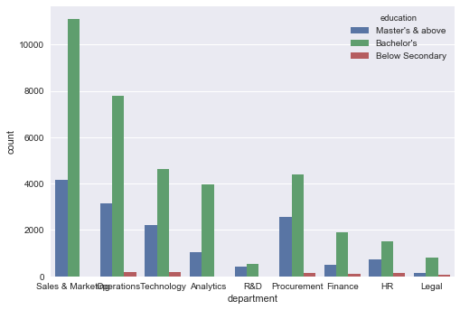

# WNS Machine Learning Challenge

The hackathon was for the purpose of carring out an analysis within the HR area.
Training set of employee data with below data

department
region
education
gender
recruitment_channel
no_of_trainings
age
previous_year_rating
length_of_service
KPIs_met >80%
awards_won?
avg_training_score

The Algorithm should predict is_promoted variable.


```python
import numpy as np
import pandas as pd
import matplotlib.pyplot as plt
%matplotlib inline
import seaborn as sns
from sklearn.model_selection import train_test_split
```


```python
mk_train_df = pd.read_csv("E:\\Datathom\\wns\\train_LZdllcl.csv", index_col="employee_id")
mk_train_df_old = mk_train_df.copy(deep=True)
#sns.countplot(data=mk_train_df,x='is_promoted')
mk_train_df_old
print(mk_train_df.apply(lambda x: sum(x.isnull()), axis=0))

sns.countplot(data=mk_train_df_old,x='department', hue='education')
# Use to test the acccuracy within Trainign set
# Uncomment all below

#x_train1, x_test1, y_train1, y_test1 = train_test_split(mk_train_df.loc[:,mk_train_df.columns != 'is_promoted'], mk_train_df['is_promoted'], test_size=0.33, random_state=55)
#mk_train_df = pd.concat([x_train1,y_train1],axis=1)
#mk_test_df_old = pd.concat([x_test1,y_test1],axis=1)
#mk_train_df.head(5)
```

    department                 0
    region                     0
    education               2409
    gender                     0
    recruitment_channel        0
    no_of_trainings            0
    age                        0
    previous_year_rating    4124
    length_of_service          0
    KPIs_met >80%              0
    awards_won?                0
    avg_training_score         0
    is_promoted                0
    dtype: int64
    


    <matplotlib.axes._subplots.AxesSubplot at 0x1e438f82ac8>





This step is data preparation - Varible creation
We observed a null values for Education and Previous_Year_rating.  We need to handle them
- When we drew a chart for Education and found that Bachelor degree is mean for all the department
- Similar chart showed mean rating was 3. 
Hence we did null handelling 


Next up, we observed the varibles department and region were categorical variable.
So we wanted to create dummy variables.

We also created addional variable like what is the % of training an employee has completed as compared to regional average or compared to department


```python
def convert_res (x, const):
    if(x==const):
        return 1
    else :
        return 0

# Resample 
# Create Train/test data (Undo later)
mk_train_df = mk_train_df_old.copy(deep=True)

# Take care or null values
mk_train_df.loc[mk_train_df["previous_year_rating"].isnull(), "previous_year_rating"] = 3.0;
mk_train_df.loc[mk_train_df["education"].isnull(), "education"] = "Bachelor's";

# Other way to add Dummy Variables
mk_train_df = pd.concat([mk_train_df,pd.get_dummies(mk_train_df['gender'], prefix='gender')],axis=1)
mk_train_df = pd.concat([mk_train_df,pd.get_dummies(mk_train_df['department'], prefix='department')],axis=1)
mk_train_df = pd.concat([mk_train_df,pd.get_dummies(mk_train_df['region'], prefix='region')],axis=1)
mk_train_df = pd.concat([mk_train_df,pd.get_dummies(mk_train_df['recruitment_channel'], prefix='recruitment_channel')],axis=1)
mk_train_df = pd.concat([mk_train_df,pd.get_dummies(mk_train_df['education'], prefix='education')],axis=1)

# Convert Categorical values into Label
from sklearn import preprocessing


# New Fields added
train_reg_df = pd.DataFrame()
train_reg_df['reg_num_train'] = mk_train_df.groupby(["region"])['no_of_trainings'].mean()
train_reg_df['reg_age'] = mk_train_df.groupby(["region"])['age'].mean()
train_reg_df['reg_prev_rat'] = mk_train_df.groupby(["region"])['previous_year_rating'].mean()
train_reg_df['reg_len_serv'] = mk_train_df.groupby(["region"])['length_of_service'].mean()
train_reg_df['reg_kpi'] = mk_train_df.groupby(["region"])['KPIs_met >80%'].mean()
#train_reg_df['reg_awards'] = mk_train_df.groupby(["region_l"])['awards_won?'].mean()
train_reg_df['reg_avg_training_score'] = mk_train_df.groupby(["region"])['avg_training_score'].mean()

train_dept_df = pd.DataFrame()
train_dept_df['dep_num_train'] = mk_train_df.groupby(["department"])['no_of_trainings'].mean()
#train_dept_df['dep_age'] = mk_train_df.groupby(["department"])['age'].mean()
#train_dept_df['dep_prev_rat'] = mk_train_df.groupby(["department"])['previous_year_rating'].mean()
train_dept_df['dep_len_serv'] = mk_train_df.groupby(["department"])['length_of_service'].mean()
train_dept_df['dep_kpi'] = mk_train_df.groupby(["department"])['KPIs_met >80%'].mean()
train_dept_df['dep_awards'] = mk_train_df.groupby(["department"])['awards_won?'].mean()
train_dept_df['dep_avg_training_score'] = mk_train_df.groupby(["department"])['avg_training_score'].mean()

mk_train_df = mk_train_df.join(train_dept_df, on="department")
mk_train_df = mk_train_df.join(train_reg_df, on="region")

mk_train_df['reg_num_train_per'] = mk_train_df['no_of_trainings'] / mk_train_df['reg_num_train']
mk_train_df['reg_age_per'] = mk_train_df['age'] / mk_train_df['reg_age']
mk_train_df['reg_prev_rat_per'] = mk_train_df['previous_year_rating'] / mk_train_df['reg_prev_rat']
mk_train_df['reg_len_serv_per'] = mk_train_df['length_of_service'] / mk_train_df['reg_len_serv']
mk_train_df['reg_kpi_per'] = mk_train_df['KPIs_met >80%'] / mk_train_df['reg_kpi']
mk_train_df['reg_avg_training_score_per'] = mk_train_df['avg_training_score'] / mk_train_df['reg_avg_training_score']

mk_train_df['dep_num_train_per'] = mk_train_df['no_of_trainings'] / mk_train_df['dep_num_train']
mk_train_df['dep_len_serv_per'] = mk_train_df['length_of_service'] / mk_train_df['dep_len_serv']
mk_train_df['dep_kpi_per'] = mk_train_df['KPIs_met >80%'] / mk_train_df['dep_kpi']
mk_train_df['dep_awards_per'] = mk_train_df['awards_won?'] / mk_train_df['dep_awards']
mk_train_df['dep_avg_training_score_per'] = mk_train_df['avg_training_score'] / mk_train_df['dep_avg_training_score']

mk_train_df['age_num_train_per'] = mk_train_df['no_of_trainings'] / mk_train_df['age']
mk_train_df['len_servce_num_train_per'] = mk_train_df['no_of_trainings'] / mk_train_df['length_of_service']
mk_train_df['age_len_servce'] = mk_train_df['age'] / mk_train_df['length_of_service']
mk_train_df['avg_train_score_len_servce'] = mk_train_df['avg_training_score'] / mk_train_df['length_of_service']
mk_train_df['avg_train_score_age'] = mk_train_df['avg_training_score'] / mk_train_df['age']

# Remove duplicate columns
mk_train_df.drop(['recruitment_channel','region','department','gender','education'], axis=1, inplace=True)

mk_train_df.drop(['reg_num_train', 'reg_age', 'reg_prev_rat', 'reg_len_serv', 'reg_kpi', 'reg_avg_training_score', 'dep_num_train', 
            'dep_len_serv', 'dep_kpi', 'dep_awards','dep_avg_training_score'], axis=1, inplace=True)

# Create Train/test data
mk_train_df1 = mk_train_df

#print 
print(mk_train_df1['is_promoted'].value_counts())

```

    0    50140
    1     4668
    Name: is_promoted, dtype: int64
    

On comparing the is_promoted column. We observed the data set is biased.
We need to handle this. We have two ways of doing it
- Upsample minority class 
 
     During upsampling random data sets are generated to closer to the minority class. We can specify, number of random rows to be generated. This way we can make the set as balanced. 
    
- Downsample majority class
    
    During downsampling random sets of data are selected from majority class. This makes the set as balanced.

I preferred the second option. There are many algorithms to do this, like SMOTE, sklearn.resample pacakge.


```python
# Resample make categorial values equal
from sklearn.utils import resample
df_minority = mk_train_df1[mk_train_df1['is_promoted']==1]
df_majority = mk_train_df1[mk_train_df1['is_promoted']==0]
 
# Upsample minority class
df_minority_upsampled = resample(df_minority, 
                                 replace=True,     # sample with replacement
                                 n_samples=50140,    # to match majority class
                                 random_state=345) # reproducible results

# Downsample minority class
df_majority_downsampled = resample(df_majority, 
                                 replace=False,     # sample with replacement
                                 n_samples=4668,    # to match majority class
                                 random_state=565) # reproducible results
 
# Combine majority class with upsampled minority class
#mk_train_df = pd.concat([df_majority, df_minority_upsampled])
mk_train_df2 = pd.concat([df_minority, df_majority_downsampled])

#mk_train_df2 = mk_train_df1
### xtrain y train
x_train=mk_train_df2.loc[:,mk_train_df2.columns != 'is_promoted'] 
y_train=mk_train_df2.loc[:,mk_train_df2.columns == 'is_promoted']

```

Next comes reading the Test Data
- We apply the same null value treatment as done with training set
- We apply same additional variables as with training set


```python
# Create Test Data
#read values from csv
#mk_test_df = mk_train_df_old[20001:25000].copy(deep=True)
mk_test_df = pd.read_csv("E:\\Datathom\\wns\\test_2umaH9m.csv", index_col="employee_id")
mk_test_df['is_promoted'] =0
#test_2umaH9m
#mk_test_df = mk_test_df_old.copy(deep=True)
print(mk_test_df.apply(lambda x: sum(x.isnull()), axis=0))

# Take care or null values
mk_test_df.loc[mk_test_df["previous_year_rating"].isnull(), "previous_year_rating"] = 3.0;
mk_test_df.loc[mk_test_df["education"].isnull(), "education"] = "Bachelor's";

# Other way to add Dummy Variables

mk_test_df = pd.concat([mk_test_df,pd.get_dummies(mk_test_df['gender'], prefix='gender')],axis=1)
mk_test_df = pd.concat([mk_test_df,pd.get_dummies(mk_test_df['department'], prefix='department')],axis=1)
mk_test_df = pd.concat([mk_test_df,pd.get_dummies(mk_test_df['region'], prefix='region')],axis=1)
mk_test_df = pd.concat([mk_test_df,pd.get_dummies(mk_test_df['recruitment_channel'], prefix='recruitment_channel')],axis=1)
mk_test_df = pd.concat([mk_test_df,pd.get_dummies(mk_test_df['education'], prefix='education')],axis=1)

#New Fields added
mk_test_df = mk_test_df.join(train_dept_df, on="department")
mk_test_df = mk_test_df.join(train_reg_df, on="region")

mk_test_df['reg_num_train_per'] = mk_test_df['no_of_trainings'] / mk_test_df['reg_num_train']
mk_test_df['reg_age_per'] = mk_test_df['age'] / mk_test_df['reg_age']
mk_test_df['reg_prev_rat_per'] = mk_test_df['previous_year_rating'] / mk_test_df['reg_prev_rat']
mk_test_df['reg_len_serv_per'] = mk_test_df['length_of_service'] / mk_test_df['reg_len_serv']
mk_test_df['reg_kpi_per'] = mk_test_df['KPIs_met >80%'] / mk_test_df['reg_kpi']
mk_test_df['reg_avg_training_score_per'] = mk_test_df['avg_training_score'] / mk_test_df['reg_avg_training_score']

mk_test_df['dep_num_train_per'] = mk_test_df['no_of_trainings'] / mk_test_df['dep_num_train']
mk_test_df['dep_len_serv_per'] = mk_test_df['length_of_service'] / mk_test_df['dep_len_serv']
mk_test_df['dep_kpi_per'] = mk_test_df['KPIs_met >80%'] / mk_test_df['dep_kpi']
mk_test_df['dep_awards_per'] = mk_test_df['awards_won?'] / mk_test_df['dep_awards']
mk_test_df['dep_avg_training_score_per'] = mk_test_df['avg_training_score'] / mk_test_df['dep_avg_training_score']

mk_test_df['age_num_train_per'] = mk_test_df['no_of_trainings'] / mk_test_df['age']
mk_test_df['len_servce_num_train_per'] = mk_test_df['no_of_trainings'] / mk_test_df['length_of_service']
mk_test_df['age_len_servce'] = mk_test_df['age'] / mk_test_df['length_of_service']
mk_test_df['avg_train_score_len_servce'] = mk_test_df['avg_training_score'] / mk_test_df['length_of_service']
mk_test_df['avg_train_score_age'] = mk_test_df['avg_training_score'] / mk_test_df['age']

# Remove duplicate columns
mk_test_df.drop(['recruitment_channel','region','department','gender','education'], axis=1, inplace=True)

mk_test_df.drop(['reg_num_train', 'reg_age', 'reg_prev_rat', 'reg_len_serv', 'reg_kpi', 'reg_avg_training_score', 'dep_num_train', 
            'dep_len_serv', 'dep_kpi', 'dep_awards','dep_avg_training_score'], axis=1, inplace=True)


x_test=mk_test_df.loc[:,mk_test_df.columns != 'is_promoted'] 
y_test=mk_test_df.loc[:,mk_test_df.columns == 'is_promoted']

#print 
#print(mk_test_df['is_promoted'].value_counts())
```

    department                 0
    region                     0
    education               1034
    gender                     0
    recruitment_channel        0
    no_of_trainings            0
    age                        0
    previous_year_rating    1812
    length_of_service          0
    KPIs_met >80%              0
    awards_won?                0
    avg_training_score         0
    is_promoted                0
    dtype: int64
    

Next we have the cleaned Training and test data set 
- We now start applying the alogrithms
- First algorithm We try the Logistic regression.
- we have split the training data into train/test
- We can evaluate the accuracy.


```python
# Run Training ##Logistic regression

from sklearn.linear_model import LogisticRegression
logisticRegr = LogisticRegression()

logisticRegr.fit(x_train, y_train)

# Check with test data 
mk_score = logisticRegr.predict_proba(x_test)
mk_score_p = logisticRegr.predict(x_test)
# Check accuracy
from sklearn.metrics import confusion_matrix
print(mk_score_p)
print(mk_score)
print("==> Log Score",logisticRegr.score(x_test, y_test))
print("==> Log Score",confusion_matrix(mk_score_p, y_test))

```

    C:\Users\kaush\Anaconda3\lib\site-packages\sklearn\utils\validation.py:578: DataConversionWarning: A column-vector y was passed when a 1d array was expected. Please change the shape of y to (n_samples, ), for example using ravel().
      y = column_or_1d(y, warn=True)
    

    [1 0 0 ... 0 0 1]
    [[0.47201027 0.52798973]
     [0.86379781 0.13620219]
     [0.97854    0.02146   ]
     ...
     [0.94094779 0.05905221]
     [0.90937339 0.09062661]
     [0.04122655 0.95877345]]
    ==> Log Score 0.7113239676458067
    ==> Log Score [[16709     0]
     [ 6781     0]]
    

Next algorithm We try the Random Forest Classification.
- we have split the training data into train/test
- We can evaluate the accuracy.


```python
# Run Training ##Random Forest

from sklearn.ensemble import RandomForestClassifier
ranfor = RandomForestClassifier()
ranfor.fit(x_train, y_train)

logisticRegr.fit(x_train, y_train)

# Check with test data 
ranfor_score = ranfor.predict_proba(x_test)
ranfor_score_p = ranfor.predict(x_test)
# Check accuracy
from sklearn.metrics import confusion_matrix
#print("==> Log Score",ranfor.score(x_test, y_test))
#print("==> Log Score",confusion_matrix(ranfor_score_p, y_test))

```

    C:\Users\kaush\Anaconda3\lib\site-packages\ipykernel\__main__.py:5: DataConversionWarning: A column-vector y was passed when a 1d array was expected. Please change the shape of y to (n_samples,), for example using ravel().
    C:\Users\kaush\Anaconda3\lib\site-packages\sklearn\utils\validation.py:578: DataConversionWarning: A column-vector y was passed when a 1d array was expected. Please change the shape of y to (n_samples, ), for example using ravel().
      y = column_or_1d(y, warn=True)
    

Next We try the Light GBM tree based model.
- we have split the training data into train/test
- We can evaluate the accuracy.


```python
# Run Training ##Light GBM
import lightgbm as lgb
gbm_train = lgb.Dataset(x_train, label=y_train['is_promoted'])

#
# Train the model
#

parameters = {
    'application': 'binary',
    'objective': 'binary',
    'metric': 'binary_logloss',
    'is_unbalance': 'false',
    'boosting': 'dart',
    'xgboost_dart_mode' : 'true',
    'uniform_drop':'true',
    'num_leaves': 15,
    'feature_fraction': 0.7,
    'bagging_fraction': 0.8,
    'bagging_freq': 10,
    'learning_rate': 0.06,
    'verbose': 0
}

gbm_test = lgb.Dataset(x_test, label=y_test['is_promoted'])

#gbm_model = lgb.train(parameters,gbm_train, valid_sets=gbm_test, num_boost_round=500, verbose_eval=10)
gbm_model = lgb.train(parameters,gbm_train)


# Check with test data 
gbm_prob_p = gbm_model.predict(x_test)
#test range = 23489, 18087
for i in range(0,23489):
    if gbm_prob_p[i]>=.8:
           gbm_prob_p[i]=1
    else:  
           gbm_prob_p[i]=0

# Check accuracy
from sklearn.metrics import confusion_matrix
from sklearn.metrics import accuracy_score
#print("==> Log Score",accuracy_score(gbm_prob_p,y_test))
#print("==> Log Score",confusion_matrix(gbm_prob_p, y_test))
from sklearn.metrics import f1_score
#print("==> F1 Score",f1_score(gbm_prob_p, y_test,average='weighted'))
#print("==> F1 Score",f1_score(gbm_prob_p, y_test,average='binary'))


#lgb_mod.fit(x_train, y_train)
```

We evaluate the three models- Observation was LightGBM was performaing better for Light GBM
So we selected it. There are other ways too
- We can merge the coefficient of the 3 model and arrive at a new consensus.
- Finally, we save the model output to csv file


```python
#Save to output
final_df = x_test.copy(deep=True)

final_df['is_promoted'] = gbm_prob_p.astype('int64')

final_df[['is_promoted']].to_csv("E:\\Datathom\\wns\\out_new.csv")
```
